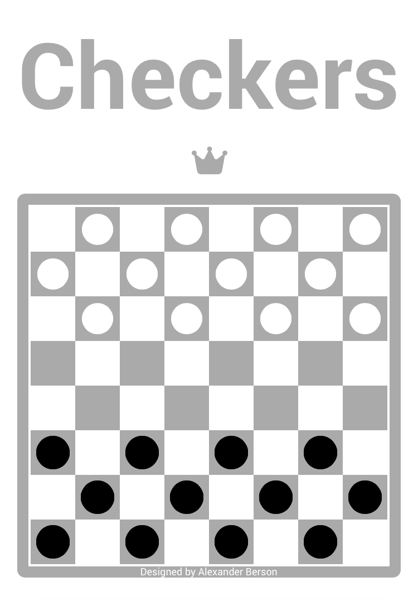

# Checkers

Capture or block all of your opponent's pieces.<br> 
You can [play Checkers against the AI online](https://alex-berson.github.io/checkers/) or <br>
[](https://apps.apple.com/us/app/checkers/id6476962739)


## Description

**Checkers**, also known as **Draughts**, is a group of strategy board games for two players which involve forward movements of uniform game pieces and mandatory captures by jumping over opponent pieces. 

*The following rules apply to the variant of the game known as **American Checkers** or **English Draughts**.*

Checkers is played by two players who oppose each other across a board of 64 light and dark squares, the same as a chessboard. The 24 playing pieces are disk-shaped and of contrasting colors (whatever their colors, they are identified as black and white). At the start of the game, each player has 12 pieces arranged over three rows with four pieces in each row, placed exclusively on the dark squares.

Play consists of advancing a piece diagonally forward to an adjoining vacant square. Black moves first, then players alternate turns. If an opponent’s piece is in such an adjoining square, with a vacant space beyond, it must be captured and removed by jumping over it to the empty square. If this square presents the same situation, successive jumps forward in a straight or zigzag direction must be completed in the same play. When there is more than one way to jump, the player has a choice.

When a piece first enters the *kings row*, the opponent’s back row, it must be crowned by placing an additional piece of the same color on top of it. The piece, now called a *king*, has the added privilege of moving and jumping backwards. However, if it moved to the last row with a capture, it cannot continue capturing as a king in the same move.  

A win is scored when an opponent’s pieces are all captured or blocked so that they cannot move. When neither side can force a victory and the trend of play becomes repetitious, a draw game is declared.

There are numerous national and regional variants of checkers, including German, Spanish, Italian, Portuguese, Russian, Czech, Slovak, Hungarian, Turkish, Armenian, Canadian, Brazilian, Argentinian, Jamaican, Ghanaian, Mozambican, Tanzanian, Malaysian/Singaporean, Myanmar, Thai, and Polish or International checkers, among others. The major differences among these variants lie in the color of the pieces that move first; the ability of ordinary pieces to capture backwards; the ability of kings to move any number of squares at a time, known as *flying kings*; the ability of pieces to continue capturing in the same move after becoming a king; the capturing rules when multiple options are available; the size, the orientation and the layout of the board, and the movement patterns of the pieces.

In most languages, checkers is called *dame*, *dames*, *damas*, or a similar term* that refers to ladies. The same term is also used to describe pieces that have been promoted to kings.
 
<details>
<summary> 
*<sub>(Click or tap to expand)</sub>
</summary>

```
Albanian - Damë  
Arabic - ضامة (Dama)  
Armenian - Տամա (Tama)  
Asturian - Dames  
Azerbaijani - Dama  
Basque - Dama  
Bosnian - Dama  
Catalan - Dames  
Corsican - Dami  
Croatian - Dama  
Czech - Dáma  
Danish - Dam  
Dutch - Dammen  
Faroese - Damm  
Finnish - Tammi  
French - Dames  
Frisian - Damjen 
Ghanaian - Damii   
German - Dame  
Greek - Ντάμα (Dama)  
Hebrew - דמקה (Damka)  
Icelandic - Damm  
Indonesian - Dam  
Italian - Dama 
Limburgish - Damme  
Macedonian - Дама (Dama)  
Malay - Dam  
Mongolian - Даам (Daam)  
Norwegian - Dam  
Portuguese - Damas  
Romanian - Dame  
Scots - Dams  
Scottish Gaelic - Dàmais  
Serbian - Дама (Dama) 
Sicilian - Dama  
Slovak - Dáma  
Slovenian - Dama  
Spanish - Damas  
Swedish - Dam  
Turkish - Dama  
Venetian - Dama  
Vietnamese - Cờ đam  
```
</details>

## Screenshot

<p align="center">
  
</p>

## License

Copyright &copy; 2024 Alexander Berson. This project is licensed under the [MIT license](LICENSE.txt "MIT License").

